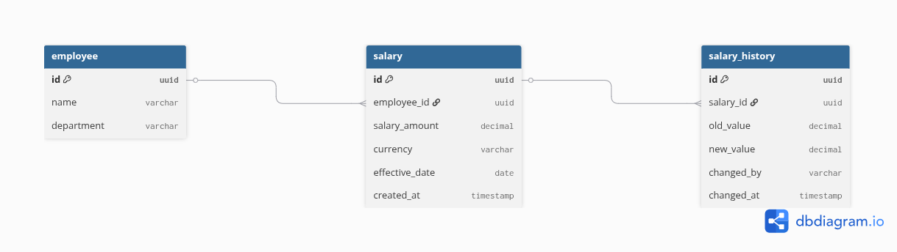

# Database Schema (ERD)

## 📌 Overview

This document presents the Entity Relationship Diagram (ERD) for the Employee Salary Management System.

---

## 🧩 Entities

### Employee

Stores employee information.

### Salary

Stores current salary details linked to employees.

### Salary History

Tracks all salary changes for audit and history purposes.

---

## 🔗 Relationships

* One employee can have multiple salary records
* One salary record can have multiple history entries

---

## 📊 ERD Diagram

